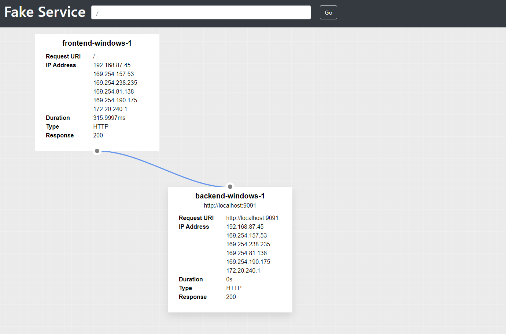

# Consul Service Mesh with Windows appliciations 

To run the example you will need [Shipyard](https://shipyard.run/docs/install#chocolatey-for-windows) for Windows and permission to execute untrusted powershell commands by your local user.

To install Shipyard follow the instructions at https://shipyard.run/docs/install#chocolatey-for-windows

Shipyard executes a powershell script to install the Conusl and Envoy binaries needed by the demo, to enable this
you can run the following command in an administrator powershell window:

**Note:**

This `unrestricted` Poweshell execution policy can pose a security risk and should only be used on disposable environments.

```shell
Set-ExecutionPolicy unrestricted
```

The folder where the binaries are dowloaded is not automatically created, if this is the first time you are running the demo you will need to create the folder.

```shell
mkdir .\shipyard\modules\consul-windows\binaries
```

Then you can run the demo:

```shell
C:\ProgramData\chocolatey\bin\shipyard.exe run ./shipyard
```

```shell
Running configuration from:  ./shipyard

2022-01-31T15:43:38.400Z [INFO]  Creating resources from configuration: path=C:\Users\jacks\code\src\github.com\hashicorp\consul-envoy-windows\shipyard
2022-01-31T15:43:38.406Z [INFO]  Generating template: ref=consul_config output=C:\Users\jacks\code\src\github.com\hashicorp\consul-envoy-windows\shipyard\modules\consul-windows\consul-server-config\server.hcl
2022-01-31T15:43:38.406Z [INFO]  Generating template: ref=backend-v2-bootstrap output=C:\Users\jacks\code\src\github.com\hashicorp\consul-envoy-windows\shipyard\modules\consul-windows\envoy-config\backend-v2-bootstrap.json
```

Shipyard will download the Consul, Envoy and Fake Service binaries and cache them in `.\shipyard\modules\consul-windows\binaries`
it will then generate the envoy bootstrap configuration for the three services from the template in `.\shipyard\modules\consul-windows\templates\envoy-bootstrap.json` and start all the applications.

## Testing the application

If you open your browser at `http://localhost:8500` you will see the Consul UI and the registered services, `frontend`,
and `backend`.


The `frontend` service is a single instance with a service mesh upstream pointing at the `backend` service consisting of two
separate instances. Opening your browser in the frontend UI will execute a request to the backend upstream.  

`http://localhost:9090`



If you refresh this page, you will see requests being loadbalanced  


=======
consul config write shipyard/consul-config/backend-splitter.hcl
```
